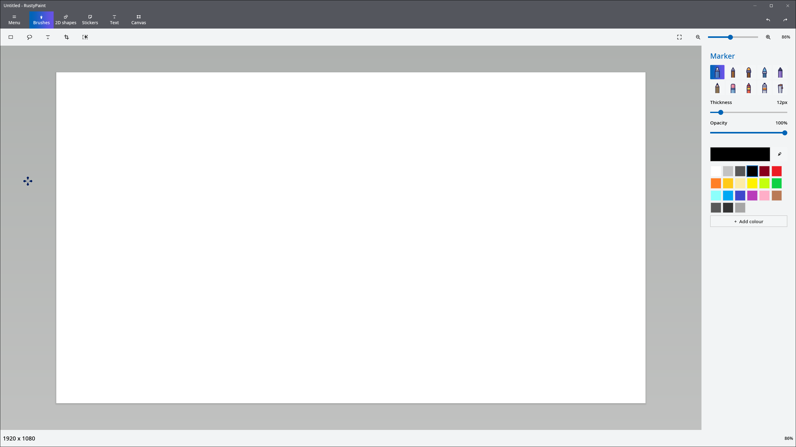
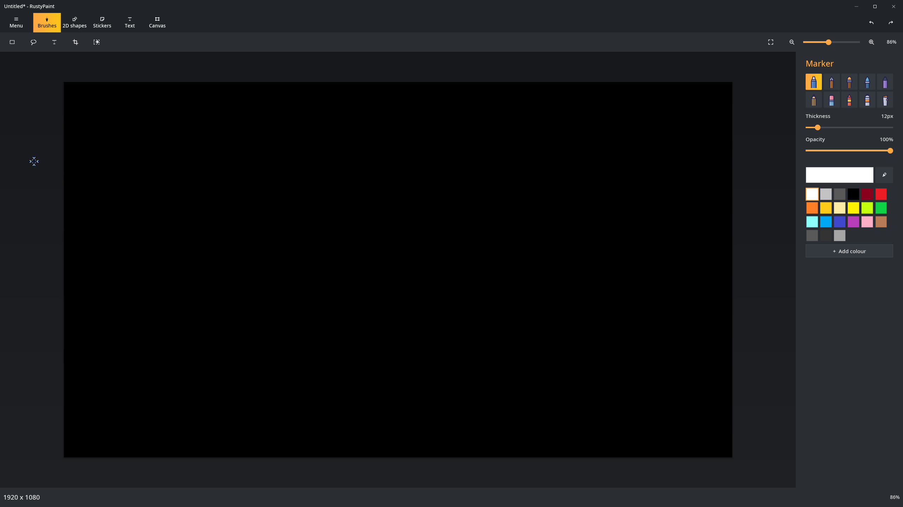
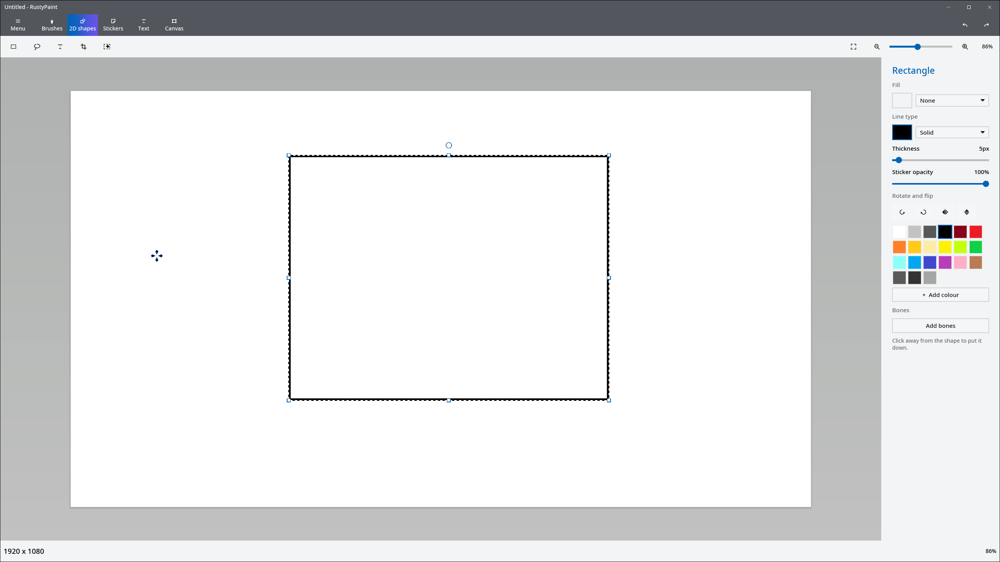
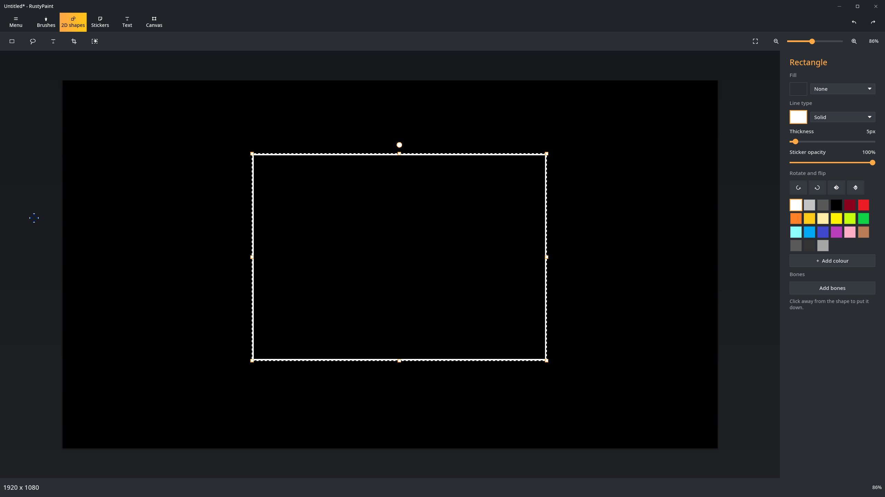
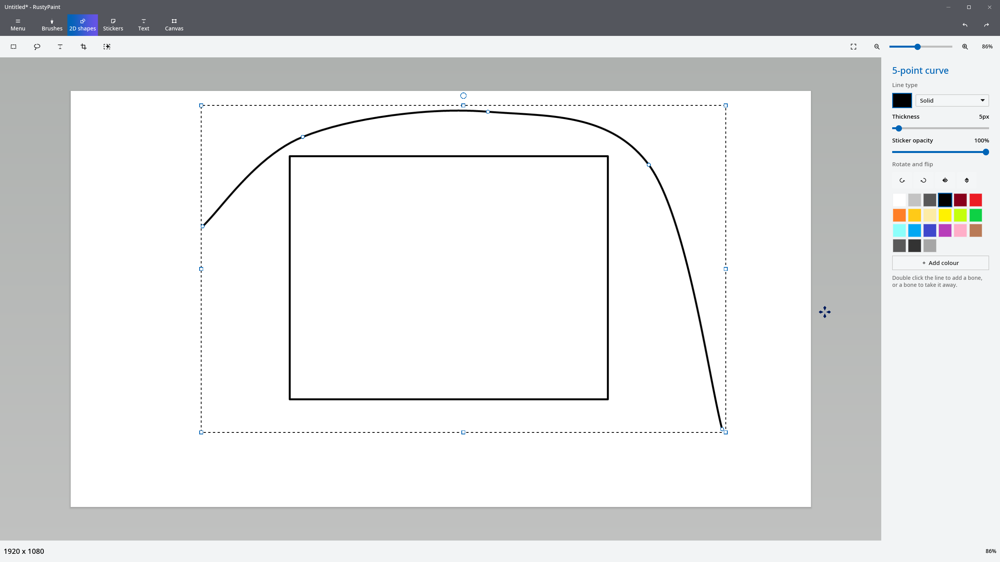
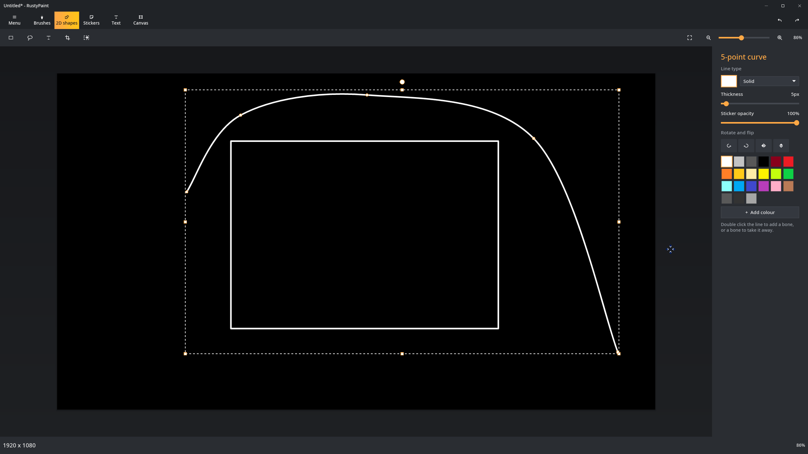
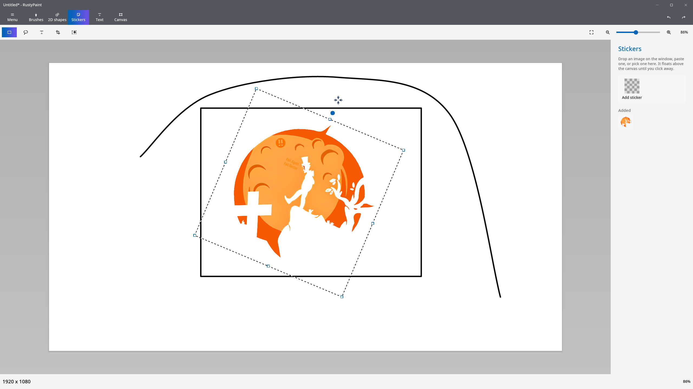
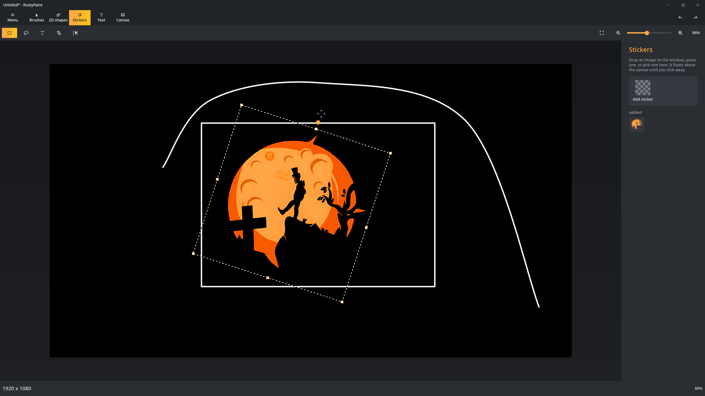
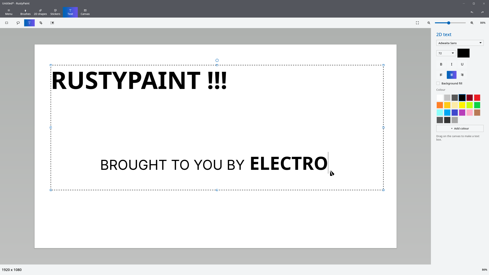
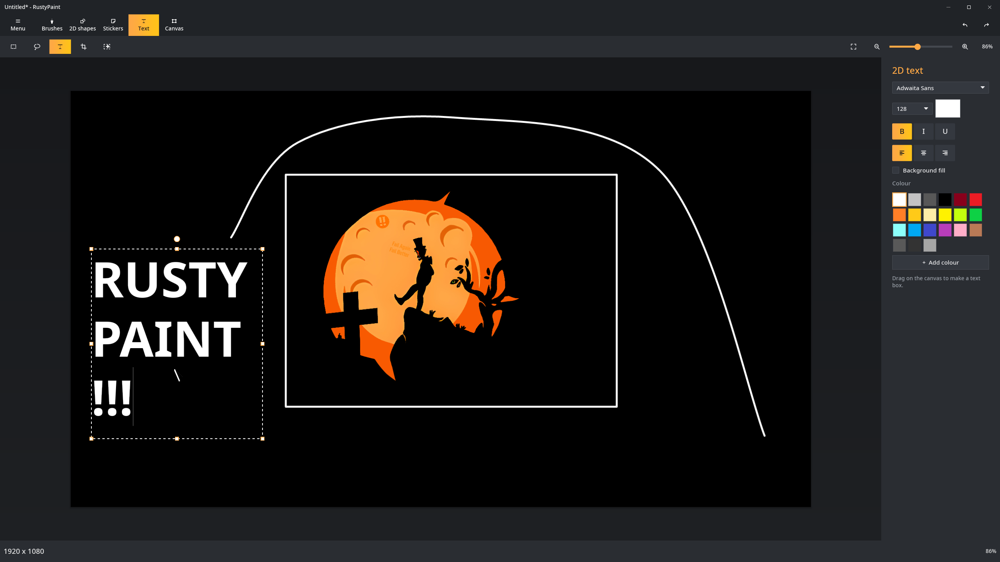

# RustyPaint

<p align="center">
  
</p>

Paint3D but without the 3D.<br>
A spiritual successor built in Rust with only the 2D tools.

## LICENSE

[GPL-3.0-only](LICENSE)

## What is this?

Microsoft retired Paint3D without ever releasing its source code.
RustyPaint brings back its simple 2D tools that I've personally grown really used to.

It's usable for everyday edits. It includes brushes, erasing, fill, colour picking, transparency, clipboard, image stickers dragged in or opened, crop, rectangle and freeform selection, Smart cutout, shapes, editable curves, adding text and basically everything that Paint3D was able to do with 2D.

It also has some QoL features like dark mode, editable curve and shape points, and a configurable new-canvas size. Things I wished Paint3D would've had. I also gave it a theme of its own, but the old colour scheme is also available.

## Screenshots

| Classic Light | Rusty Dark |
|---|---|
|  |  |
|  |  |
|  |  |
|  |  |
|  |  |

## How do I install it?

Releases offer multiple builds. An AppImage, Arch package, Debian package, RPM, Flatpak bundle, Windows MSI, and macOS DMGs for both Apple Silicon and Intel.

On Arch, install the [stable](https://aur.archlinux.org/packages/rustypaint) or [Git](https://aur.archlinux.org/packages/rustypaint-git) AUR package with your favourite helper:

For `yay`:
```sh
yay -S rustypaint
# OR
yay -S rustypaint-git
```

For `paru`:
```sh
paru -S rustypaint
# OR
paru -S rustypaint-git
```

Windows and macOS packages are not code-signed yet, so those systems will warn before opening them.

## How do I build it?

Rust 1.95 or newer is required. Linux also needs a working Vulkan driver. Windows uses Direct3D 12 and macOS uses Metal.

For an optimized build:
```sh
cargo build --release -p rustypaint
```

Package for Arch Linux:
```sh
cd packaging
makepkg -sci
```

Set `_native=1` when the package will only run on the machine that builds it.

To run directly:
```sh
cargo run -p rustypaint -- path/to/image.png
```
(omit the path to start with a new canvas)

## How is it configured?

Settings are written whenever they change in the application.

| Where? | Settings file |
|---|---|
| Linux | `~/.config/rustypaint/config.toml` |
| Flatpak | `~/.var/app/net.electris.RustyPaint/config/rustypaint/config.toml` |
| Windows | `%APPDATA%\RustyPaint\config.toml` |
| macOS | `~/Library/Application Support/RustyPaint/config.toml` |

| What? | Effect |
|---|---|
| `theme` | Uses `auto`, `light`, or `dark` |
| `accent` | Uses the `rusty` or `classic` palette |
| `new_canvas` | Selects the starting canvas dimensions |
| `custom_colours` | Keeps colours added with the picker |
| `acrylic` | Makes panels translucent for compositor blur |
| `decorations` | Lets the compositor draw the window frame |

## Where do the assets come from?

No assets that are owned by Microsoft are used in this project. The icons were made for this program specifically and the bundled font is Urbanist under the SIL Open Font License. The interface resemblance is intended for familiarity with the discontinued program.

## Disclosure

I am not affiliated with Microsoft. RustyPaint is not endorsed or acknowledged by Microsoft as an actual successor to Paint3D. It is a community reimplementation of software they chose to discard. This project is intended to preserve the 2D functionality of Paint3D and offer it to platforms the original never did.
